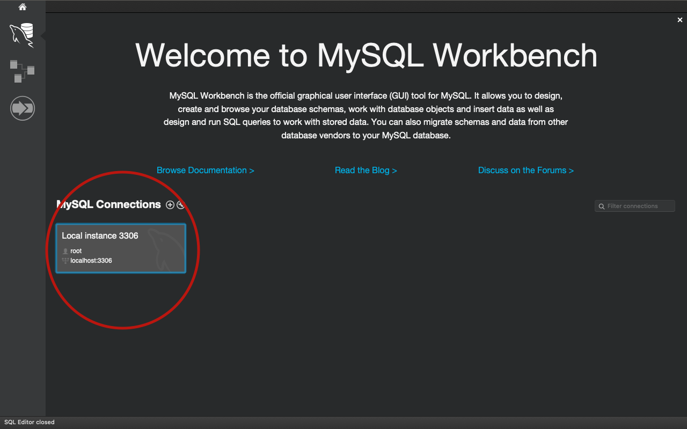
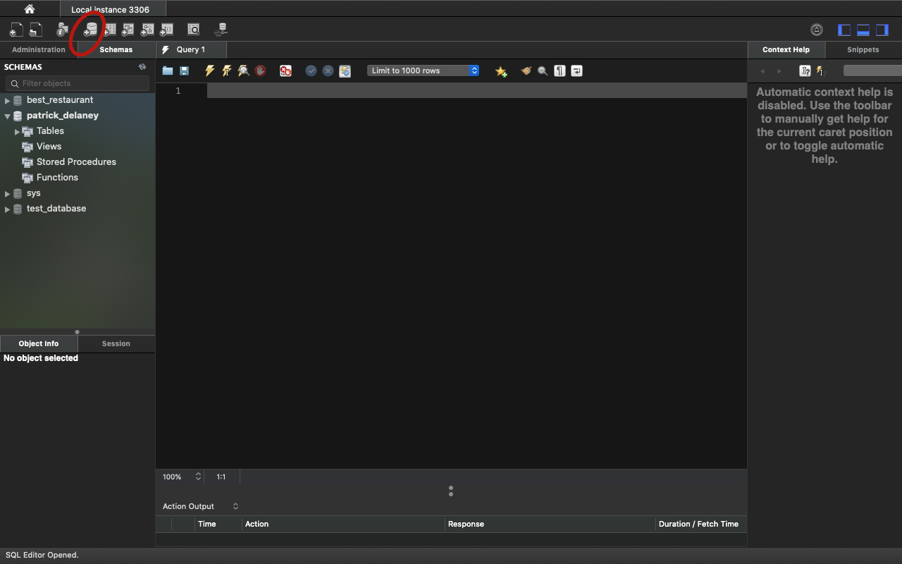
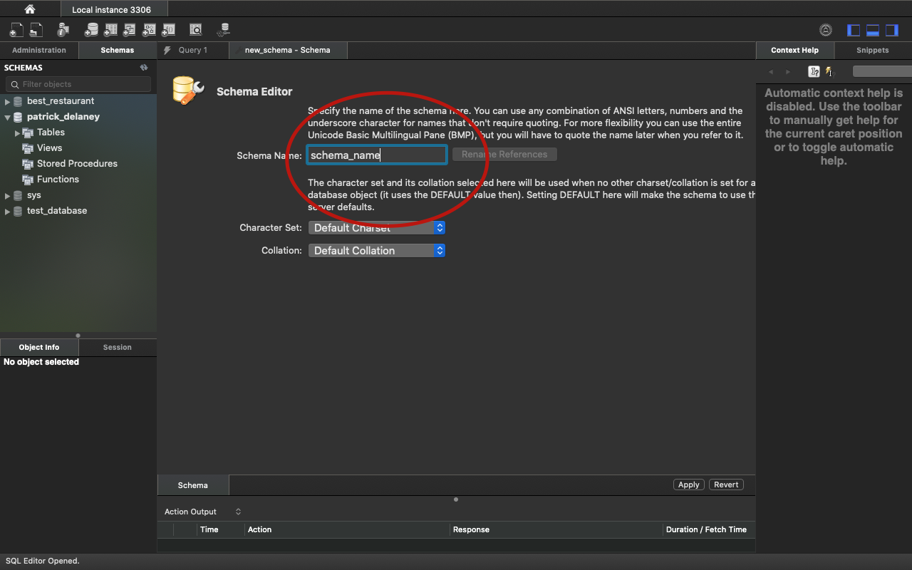
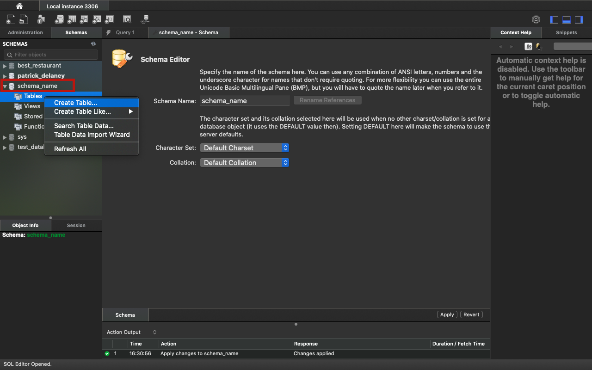
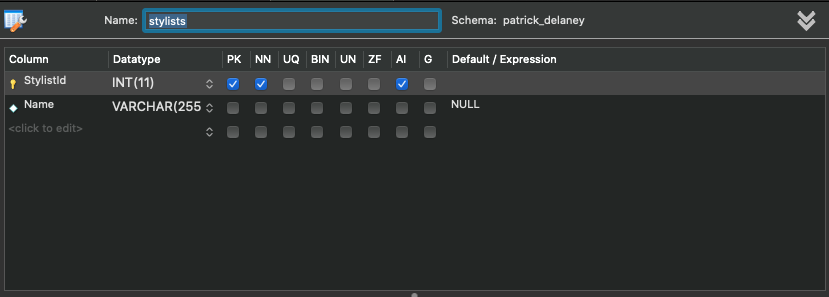
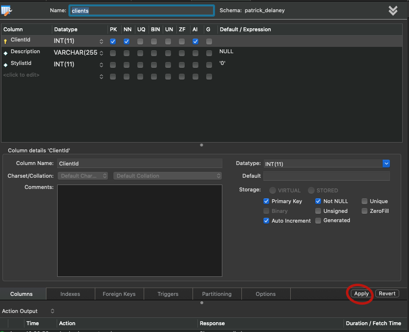

# _Hair Salon_

#### _Ann application that allows the user to view and edit different stylists details and clients._

#### By _**Patrick Delaney**_

## Description

_In this application, the user is able to naigate through different pages. Exploring a list of stylists, stylist details, and clients of said stylists. User has full ability to alter any of these fields._

## Specs

* Behavior: User is able to navigate from one webpage to another.
	* Input: *click link*
	* Output: *re-route to connected webpage*

	* Behavior: User is able to add or remove objects through the webpage.

## Setup/Installation Requirements

* (1)_Open your terminal, navigate to your desktop directory, and clone the HairSalon repository: `cd desktop` -> `git clone https://github.com/Prestwick97/HairSalon.git`._
* (2)_With the repository cloned, you're now ready to set up your database. Open your MySQL workbench and do the following:_

* (3)_Make sure your local server is running; it should run automatically when you start your computer.  Click on the selected area to open your server details._

* (4)_Click on the selected area (cylinder with a '+' symbol) to create a schema._

* (5)_Now you have to name your schema -for this program, the schema is named after me :patrick_delaney. After you've named your schema, click the 'apply' button in the bottom right corner._

* (6)_Now you have a new schema! Click on the schema name within the menu to the left. A tables tab will appear below it. Right click the tables tab and select 'create table'._

* (7)_You'll want to name your first table 'stylists'. Create the two columns as shown in the photo above. Don't forget to click the 'apply' button in the bottom right corner._

* (8)_Follow steps 6 -7 to create a new table - you'll want to name this table 'clients' and add the respective columns as seen above. Don't forget to click the 'apply' button in the bottom right corner. Congratulations, your database has been created!_

* (9) _Navigate to the root directory in your terminal and input the following commands one after another: `dotnet build` -> `dotnet run`_

* (10) _Either (cmd +) click on the link `localhost:5000`, or enter `localhost:5000` into your web broswer_
## Known Bugs

_No known bugs at this moment_

## Support and contact details

_If you have any questions, comments, concerns, or suggestions, feel free to email me at: Prestwick97@gmail.com._

## Technologies Used

* HTML
* CSS
* C#
* MVC
* MySQL
* Command Terminal

__

### License

*Licensed under the MIT opensource license.*

Copyright (c) 2020 **_Patrick Delaney_**
